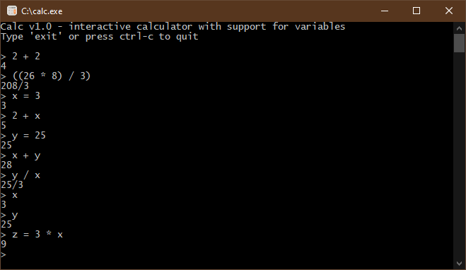

# Calc

  A general-purpose interactive calculator. Supports most mathematical operations, including variable declarations and expression evaluation.
  
  Enter 'exit' or press ctrl-c to quit.
  

## Downloads
You can <b>download</b> the latest release for <b>Windows</b> [HERE](https://github.com/DexterLagan/calc/releases).
